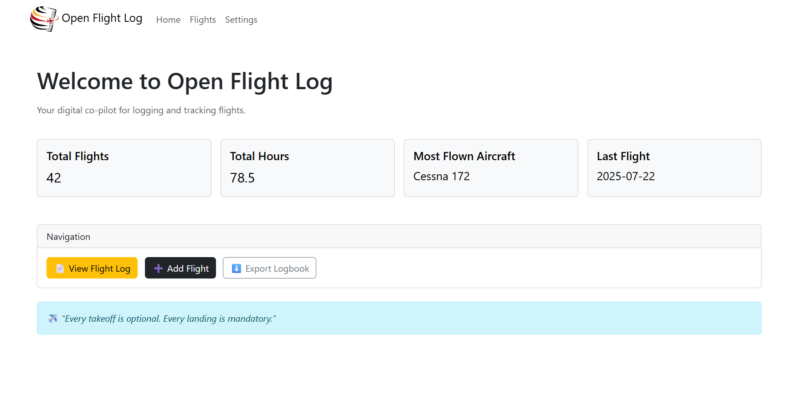
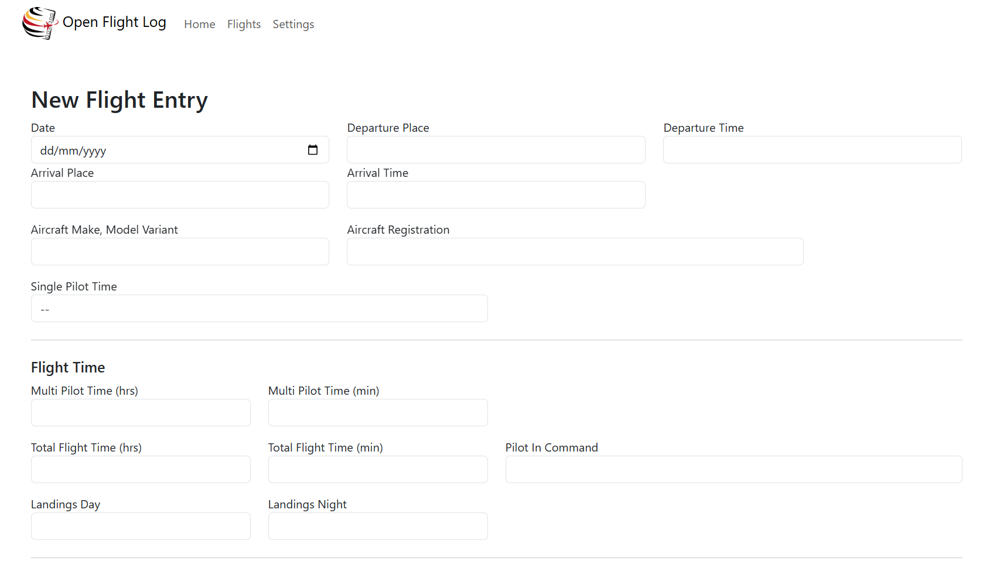

<h1>
    
    Open Flight Log
</h1>

Open Flight Log is a lightweight, web-based flight logbook and tracker for pilots.
Built with Python and FastAPI, it offers a modern alternative to traditional paper or desktop-based logbooks.

## Objective
This project aims to create a web-accessible digital flight logbook tailored for pilots. 
Unlike most existing solutions, which are closed-source and often limited to local GUI applications, 
this initiative focuses on accessibility, portability, and ease of deployment.

The goal is to provide a free and modern alternative that can be self-hosted 
or deployed with minimal setup using Docker. 
By leveraging FastAPI and SQLite, the system is designed to be lightweight yet extensible, 
making it suitable for both student and professional pilots.

The project is being developed with practical input from an active student pilot, 
ensuring it aligns with real-world needs and usability expectations. 
The ultimate objective is to make flight logging simpler, more accessible, 
and freely available to the aviation community.

## Flight Log Schema Overview

| Field | Description                                                             |
|-------|-------------------------------------------------------------------------|
| `date` | Date on which the flight commences (UTC)                               |
| `dept_place` / `arrv_place` | ICAO/IATA or airport name                         |
| `dept_time` / `arrv_time` | Departure and arrival time (UTC)                    |
| `aircraft_type` | Type/Model of the aircraft                                    |
| `aircraft_registration` | Aircraft registration code                            |
| `single_pilot_time` | SE or ME (Single Engine / Multi Engine)                   |
| `multi_pilot_time_hrs/min` | Hours and minutes of multi-pilot time              |
| `total_flight_time_hrs/min` | Total flight time (hh/mm)                         |
| `pilot_in_command` | PIC name or "SELF"                                         |
| `landings_day/night` | Number of landings (day/night)                           |
| `oct_night_hrs/min` | (Operational Condition Time) Flight time undertaken at night (hh/mm)  |
| `oct_ifr_hrs/min` | (Operational Condition Time) Instrument Flight Rules time (hh/mm)       |
| `pft_pic_hrs/min` | (Pilot Function Time) Flight time as PIC, SPIC and PICUS as PIC (hh/mm) |
| `pft_copilot_hrs/min` | Co-pilot time (hh/mm)                                   |
| `pft_dual_hrs/min` | Dual training time (hh/mm)                                 |
| `pft_instructor_hrs/min` | Instructor time (hh/mm)                              |
| `fstd_date` | Date of simulator session                                         |
| `fstd_type` | Type of FSTD (e.g. FNPT II, B747-400)                             |
| `fstd_total_time_sess_hrs/min` | Simulator session time (hh/mm)                 |
| `remarks` | Endorsements, remarks, SPIC/PICUS signature, training notes         |

## Installation

### Python/Local
1. Download the repository and extract the archive. 
2. Open a terminal in the open-flight-log folder.
3. Install requirements via `pip install -r requirements.txt`
4. Run app via `python main.py`
5. Open a browser window and navigate to `localhost:9966`

### Docker Hub / Container
[stassenoy/open-flight-log](https://hub.docker.com/r/stassenoy/open-flight-log)
1. docker pull stassenoy/open-flight-log
   - Optional: add a shared path for: `/run` so that the database is persistent.
   - Optional: Change the host port for container port `9966`
2. Open a browser window and navigate to `http://[IP]:[PORT:9966]/`

## Screenshots

## Current functionalities
- [X] Add flight logs
- [X] Query all flight logs table
- [X] Pilot stats dashboard
- [X] Export flight logs to CSV

## Future implementations
- [ ] Edit individual flight log
- [ ] Remove individual flight log
- [ ] Airport autofill
- [ ] Dockerfile
